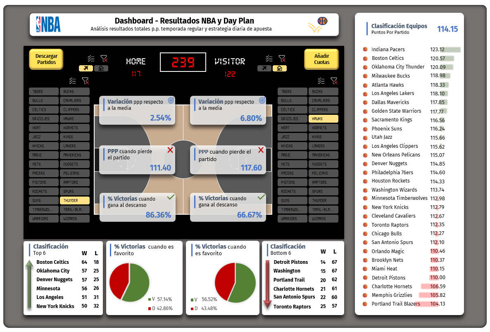
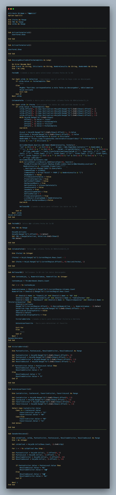

# 🏀 NBA Dashboard – Seguimiento y análisis de apuestas deportivas

Dashboard automatizado en Excel que descarga, organiza y analiza los partidos de la NBA mediante VBA y Power Query.  
El objetivo es facilitar la toma de decisiones en apuestas deportivas, especialmente en el mercado de total de puntos ("over/under").

## 🚀 Funcionalidades
- Descarga automática de resultados desde *hispanosnba.com*.
- Registro de cuotas y resultados en una base de datos interna.
- Determinación de ganadores, favoritos y tendencias de puntos.
- Formularios de usuario para facilitar la interacción.

## 🧩 Tecnologías
- **Excel + VBA (Visual Basic for Applications)**
- **Power Query**
- **Automatización de datos**
- **Análisis deportivo / apuestas**

## 📸 Capturas

## 🎥 Demo interactiva 
[https://www.loom.com/share/68209c54fa1942c286c37954fc3129f1?sid=4d08d18b-a92c-45ff-b19a-960b1668338f](https://www.loom.com/share/68209c54fa1942c286c37954fc3129f1?sid=4d08d18b-a92c-45ff-b19a-960b1668338f)

## 📂 Estructura del proyecto
- `Dashboard_NBA.xlsm` → archivo principal con macros.
- `/vba/` → código VBA exportado en texto.
- `/docs/` → documentación y detalles del proyecto.

## 💻 Autor
Cristian Gamón Asins  
📧 contacto: cristiangamon11@gmail.com  
🔗 [Portfolio Web](https://cristiangamon.com)
